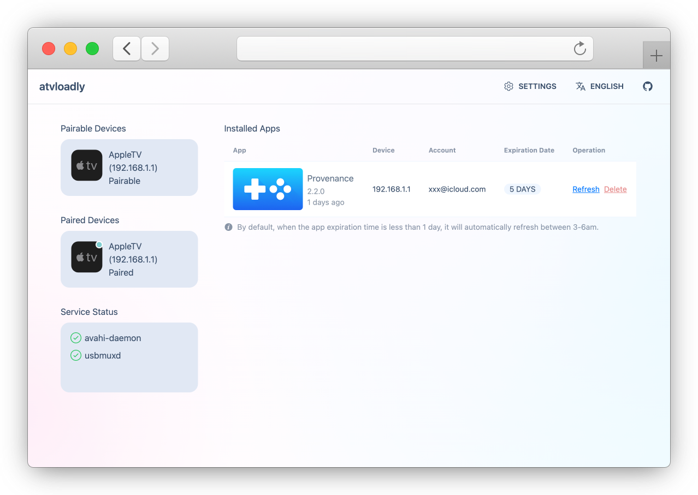
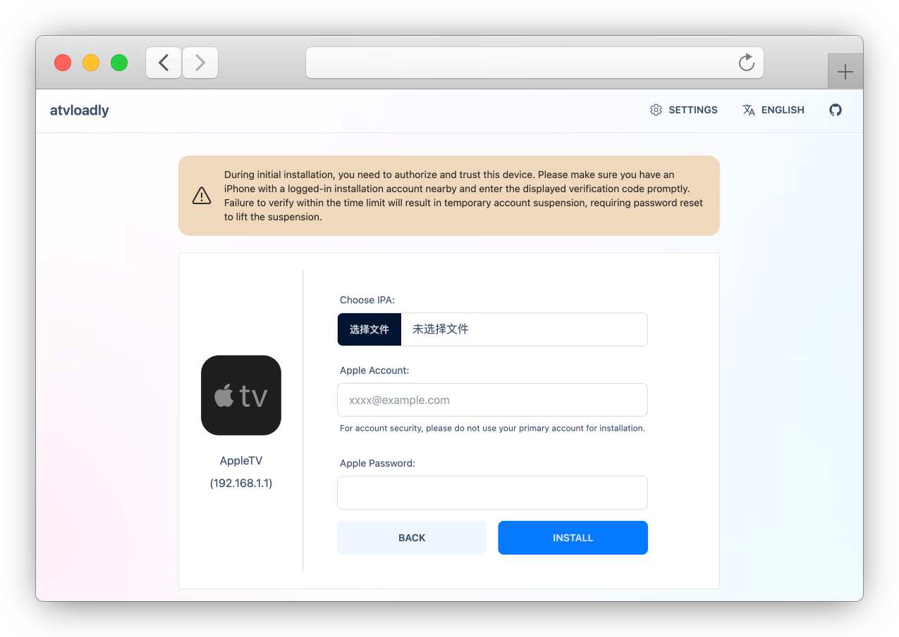

<p align="center">
  
</p>


<div align="center">

[](https://github.com/bitxeno/atvloadly/internal/releases)
[](https://hub.docker.com/r/bitxeno/atvloadly)
[](https://hub.docker.com/r/bitxeno/atvloadly)
[](https://hub.docker.com/r/bitxeno/atvloadly)
[](https://github.com/bitxeno/atvloadly/internal/blob/master/LICENSE)

</div>

<div align="center">

English | [中文](./README_cn.md)

</div>

atvloadly is a web service that supports sideloading app on Apple TV. It uses [PlumeImpactor](https://github.com/khcrysalis/PlumeImpactor) as the underlying technology for sideloading and automatically refreshes the app to ensure its long-term availability.

## Features

* Docker running (only supports Linux/OpenWrt platforms)
* Supports AppleTV pairing
* Supports automatic app refresh
* Supports use of multiple Apple ID accounts
* I18n support

## Screenshots

<p align="center">
  
</p>
<p align="center">
  
</p>

## Installation

> 😔 **Only supports Linux/OpenWrt systems, does not support Mac/Windows systems.**

1. The Linux/OpenWrt host needs to install `avahi-deamon`.
   
   **OpenWrt：**
   ```
   opkg install avahi-dbus-daemon
   /etc/init.d/avahi-daemon start
   ```
   
   **Ubuntu:**
   ```
   sudo apt-get -y install avahi-daemon
   sudo systemctl restart avahi-daemon
   ```

2. Please refer to the following command for installation, remember to modify the mount directory.
   
   **Docker:**
   ```
   docker run --privileged -d --name=atvloadly --restart=always -p 5533:80 -v /path/to/mount/dir:/data -v /var/run/dbus:/var/run/dbus -v /var/run/avahi-daemon:/var/run/avahi-daemon bitxeno/atvloadly:latest
   ```

   The `/var/run/dbus` and `/var/run/avahi-daemon` of the host machine need to be shared with the docker container for use.

   If you want to use the HOST network and want to modify the listening port, you can add environment variables to container:

   ```
   SERVICE_PORT=5533
   ```

   **Docker Compose:**
   ```
   wget https://raw.githubusercontent.com/bitxeno/atvloadly/refs/heads/master/docker-compose.yml
   docker compose pull
   docker compose up -d
   ```


## Getting Started

### Preparation (very important‼️)

1. A burned account
> Dedicated Apple ID installation account, both free or developer accounts are acceptable (**For security reasons, avoid using commonly used accounts. Instead, create a burned account for installation!**)
2. A phone to 2FA Verification
> atvloadly needs to be authorized as a trusted device (it will be virtualized as a MacBook). . When logging in, Apple will send a 2FA verification code to the registered phone number of your account or to a device that has already logged in with the installation account. Please authorize and verify promptly.

### Operation process

1. Open the Apple TV settings menu, select `Remote and Devices -> Remote App and Devices`, enter pairing mode.
2. Open the web management page, normally it will display the pairable `AppleTV`.
3. Click on the `AppleTV` device to enter the pairing page and complete the pairing operation.
4. After successful pairing, return to the home page, where the connected `AppleTV` will be displayed.
5. Click on the connected `AppleTV` to enter the sideload installation page, select the IPA file that needs to be sideloaded, and click `Install`.

## FAQ

1. How many apps can be installed with a free account?

> Each free Apple ID can register up to 10 apps and activate up to 3 apps simultaneously. Installing more than 3 will cause previously installed apps to become unavailable.

2. Installation failure after system upgrade.

> After upgrading the system, re-pairing is required. Generally, newly released systems are not supported. It is recommended to disable automatic system updates.

3. Can App-specific passwords be used for passwords? Is it more secure this way?

> Currently does not support it.

## How to build

[>> wiki](https://github.com/bitxeno/atvloadly/wiki/How-to-build)

## Donation

**atvloadly** is a free open source software that benefits from the open source community, if you appreciate my current work, you can buy me a cup of coffee ☕️.

[](https://ko-fi.com/H2H8NU37J)

[](https://afdian.com/a/bitxeno)

Thanks for all the love and support ❤️

## Disclaimer

* This software is only for learning and communication purposes. The author does not assume any legal responsibility for the security risks or losses caused by the use of this software.
* Before using this software, you should understand and bear corresponding risks, including but not limited to account freezing, which are unrelated to this software.
