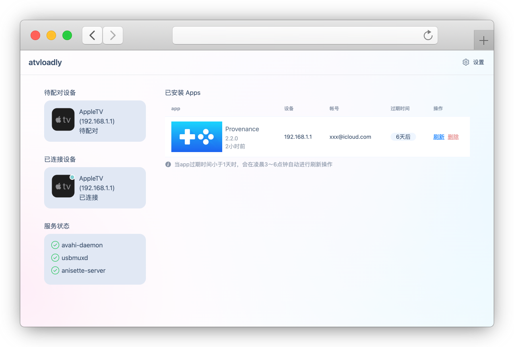
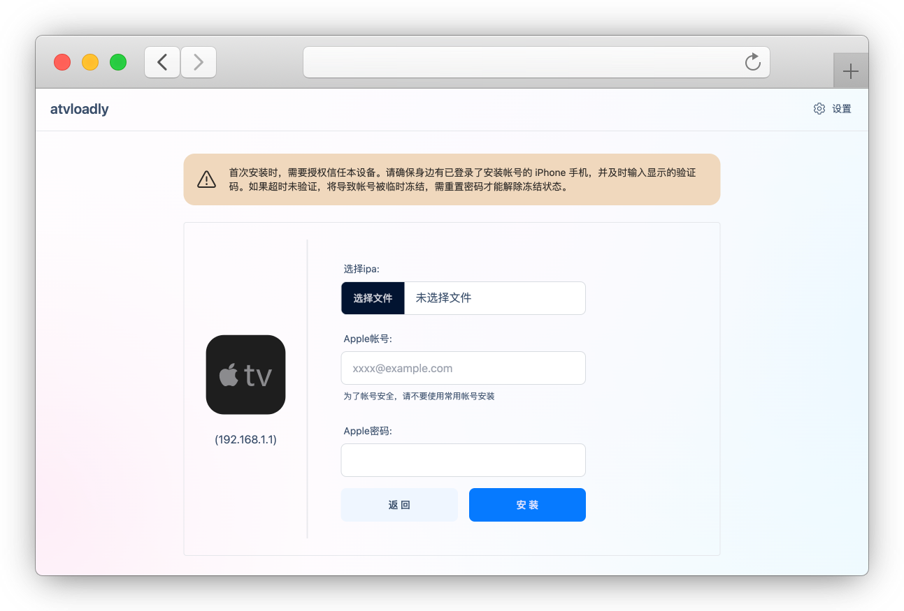

<p align="center">
  
</p>


<div align="center">

[](https://github.com/bitxeno/atvloadly/internal/releases)
[](https://hub.docker.com/r/bitxeno/atvloadly)
[](https://hub.docker.com/r/bitxeno/atvloadly)
[](https://hub.docker.com/r/bitxeno/atvloadly)
[](https://github.com/bitxeno/atvloadly/internal/blob/master/LICENSE)

</div>

<div align="center">

[English](./README.md) | 中文

</div>

atvloadly 是一个支持在 AppleTV 上侧载应用的 web 服务。底层通过使用 [PlumeImpactor](https://github.com/khcrysalis/PlumeImpactor) 实现侧载，并会自动刷新 App 以保证其长期可用性。


## 主要功能

* docker 运行 (只支持 Linux/OpenWrt 平台)
* 支持 AppleTV 配对
* 支持自动刷新 app
* 支持同时使用多个 Apple ID 帐号
* i18n 多语言支持

## 截图

<p align="center">
  
</p>
<p align="center">
  
</p>

## 安装

> 😔 **只支持 Linux/OpenWrt 系统，不支持 Mac/Windows 系统**

1. Linux/OpenWrt 宿主机需要安装 `avahi-deamon` 服务
   
   **OpenWrt：**
   ```
   opkg install avahi-dbus-daemon
   /etc/init.d/avahi-daemon start
   ```
   
   **Ubuntu:**
   ```
   sudo apt-get -y install avahi-daemon
   sudo systemctl restart avahi-daemon
   ```

2. 请参考下面的命令进行安装，记得修改下 mount 目录
   
   **Docker:**
   ```
   docker run --privileged	-d --name=atvloadly --restart=always -p 5533:80 -v /path/to/mount/dir:/data -v /var/run/dbus:/var/run/dbus -v /var/run/avahi-daemon:/var/run/avahi-daemon  bitxeno/atvloadly:latest
   ```
   
   宿主机的 `/var/run/dbus` 和`/var/run/avahi-daemon` 需要共享给 docker 容器使用

   假如你想使用 HOST 网络环境，想修改监听端口，可以给容器添加环境变量：

   ```
   SERVICE_PORT=5533
   ```

   **Docker Compose:**
   ```
   wget https://raw.githubusercontent.com/bitxeno/atvloadly/refs/heads/master/docker-compose.yml
   docker compose pull
   docker compose up -d
   ```


## 使用方法

### 前期准备 (非常重要‼️)

1. 专用的 Apple ID 安装帐号
> 免费或开发者帐号都可以（**为了安全考虑，请不要使用常用帐号安装！**)
2. 用于接收 2FA 验证码的手机
> atvloadly 需要授权才能正常使用（会虚拟为一台 MacBook），登陆时苹果会向你安装帐号的注册手机号或已登陆了安装帐号的设备发送 2FA 验证码，请及时授权验证。


### 操作流程

1. 打开 Apple TV 设置菜单，选择 `遥控器与设备 -> 遥控器App与设备`，进入配对模式
2. 打开 Web 管理页面，正常会显示可配对的 `AppleTV`
3. 点击 `AppleTV` 设备进入配对页面，并完成配对操作。
4. 配对成功后返回首页，将显示已连接的 `AppleTV` 
5. 点击已连接的 `AppleTV` 进入侧载安装页面，选择需要侧载的 IPA 文件并点击`安装`。

## 常见问题

1、免费帐号可以安装多少个应用

> 每个免费帐号最多注册 10 个 App，而且只能同时激活 3 个 App，安装超过 3 个后，会导致前面已安装的 App 变为不可用

2、找不到 AppleTV

> 请关闭 VPN，并重启 AppleTV，重新进入配对模式，确保在[**工具**]菜单中能发现`_remotepairing-manual-pairing._tcp`类型的设备，并重新配对连接

3、登陆苹果帐号失败

> 可能触发了苹果的风控，苹果对部分地区登录有限制，可以尝试在设置中添加代理试下。或者新建个帐号再试下。

4、IPA 安装后闪退

> 假如 IPA 需要 CloudKit 等权限，只有付费开发者帐号才能签名开通。atvloadly 侧载后会修改 IPA 的 `Bundle Identifier`，部分 IPA 也会限制导致闪退。

5、升级系统后安装失败

> 升级系统后需要重新配对，一般新出的系统都不支持，建议关闭系统自动更新

6、密码可以使用 App-specific password 吗，这样安全些

> 目前不支持

## API

- `/healthcheck`: 返回服务健康状态（200 表示运行正常，503 表示有 app 过期了）

- `/mcp`: MCP 服务接口，Streamable HTTP传输方式，可以接入 AI Agent 安装或刷新 app

## 推荐开源 App

[>> wiki](https://github.com/bitxeno/atvloadly/wiki/AppleTV-App)


## 如何开发编译

[>> wiki](https://github.com/bitxeno/atvloadly/wiki/How-to-build)

## 致谢

[Impactor](https://github.com/claration/Impactor)：侧载核心

[idevice](https://github.com/jkcoxson/idevice)：纯 Rust 实现的 libimobiledevice

[usbmuxd2](https://github.com/tihmstar/usbmuxd2)：Linux 上的 usbmuxd 实现

[frida-core:](https://github.com/frida/frida-core): 远程配对连接参考

## 免责声明

* 本软件仅供学习交流使用，作者不对用户因使用本软件造成的安全风险或损失承担任何法律责任；
* 在使用本软件之前，你应了解并承担相应的风险，包括但不限于账号被冻结等，与本软件无关；