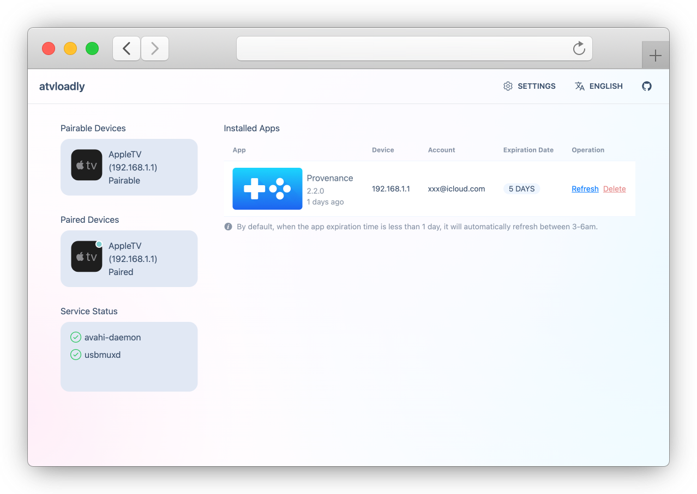
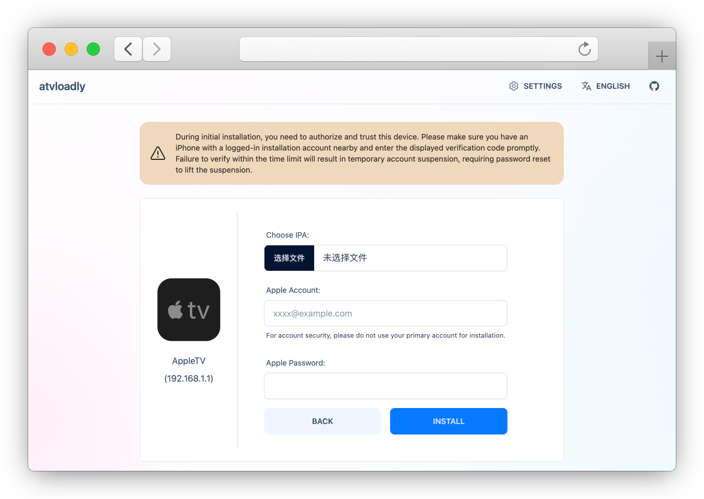

<p align="center">
  
</p>


<div align="center">

[](https://github.com/bitxeno/atvloadly/internal/releases)
[](https://hub.docker.com/r/bitxeno/atvloadly)
[](https://hub.docker.com/r/bitxeno/atvloadly)
[](https://hub.docker.com/r/bitxeno/atvloadly)
[](https://github.com/bitxeno/atvloadly/internal/blob/master/LICENSE)

</div>

<div align="center">

[English](./README.md) | Svenska | [中文](./README_cn.md)

</div>

atvloadly är en webbtjänst för sideloading av appar på Apple TV. Den använder [Impactor](https://github.com/claration/Impactor) som underliggande teknik för sideloading och uppdaterar automatiskt apparna för att de ska fortsätta vara tillgängliga.

## Funktioner

* Körs i Docker (stöder endast Linux/OpenWrt)
* Stöd för parkoppling med Apple TV
* Stöd för automatisk appuppdatering
* Stöd för att följa GitHub Releases / AltStore-källor med manuella eller automatiska appuppdateringar
* Stöd för flera Apple ID-konton
* Stöd för flera språk (i18n)

## Skärmbilder

<p align="center">
  
</p>
<p align="center">
  
</p>

## Installation

> 😔 **Stöder endast Linux/OpenWrt. Mac och Windows stöds inte.**

1. Linux/OpenWrt-värden måste ha `avahi-daemon` installerad.
   
   **OpenWrt:**
   ```
   opkg install avahi-dbus-daemon
   /etc/init.d/avahi-daemon start
   ```
   
   **Ubuntu:**
   ```
   sudo apt-get -y install avahi-daemon
   sudo systemctl restart avahi-daemon
   ```

2. Använd följande kommando för installation och ändra sökvägen för den monterade datakatalogen.
   
   **Docker:**
   ```
   docker run --security-opt seccomp:unconfined -d --name=atvloadly --restart=always -p 5533:80 -v /path/to/mount/dir:/data -v /var/run/dbus:/var/run/dbus -v /var/run/avahi-daemon:/var/run/avahi-daemon bitxeno/atvloadly:latest
   ```

   Värdsystemets `/var/run/dbus` och `/var/run/avahi-daemon` måste delas med Docker-containern.

   Om du vill använda host-nätverk och ändra lyssningsport kan följande miljövariabel läggas till i containern:

   ```
   SERVICE_PORT=5533
   ```

   **Docker Compose:**
   ```
   wget https://raw.githubusercontent.com/bitxeno/atvloadly/refs/heads/master/docker-compose.yml
   docker compose pull
   docker compose up -d
   ```

## Kom igång

### Förberedelser (mycket viktigt‼️)

1. Ett separat Apple ID för installation
> Både gratis- och utvecklarkonton fungerar. **Använd av säkerhetsskäl inte ditt vanliga Apple ID för installation. Skapa ett separat konto för detta.**

2. En telefon eller annan enhet för tvåfaktorsautentisering
> atvloadly måste auktoriseras som en betrodd enhet och emulerar då en MacBook. Vid inloggning skickar Apple en verifieringskod till kontots registrerade telefonnummer eller till en enhet som redan är inloggad med installationskontot. Godkänn och verifiera när koden visas.

### Arbetsgång

1. Öppna inställningarna på Apple TV och välj `Fjärrkontroller och enheter -> Fjärrapp och enheter` för att gå in i parkopplingsläge.
2. Öppna webbgränssnittet. En parkopplingsbar `AppleTV` ska normalt visas.
3. Klicka på `AppleTV` för att öppna parkopplingssidan och slutför parkopplingen.
4. Efter lyckad parkoppling går du tillbaka till startsidan där den anslutna `AppleTV`-enheten visas.
5. Klicka på den anslutna `AppleTV`-enheten för att öppna installationssidan, välj IPA-filen som ska sideloadas och klicka på `Installera`.

## Vanliga frågor

1. Hur många appar kan installeras med ett gratiskonto?

> Varje gratis Apple ID kan registrera upp till 10 appar och ha upp till 3 appar aktiva samtidigt. Om fler än 3 appar installeras kan tidigare installerade appar sluta fungera.

2. Apple TV hittas inte

> Stäng av VPN, starta om Apple TV, gå in i parkopplingsläget igen och kontrollera att **[Verktyg]** kan upptäcka enheter av typen `_remotepairing-manual-pairing._tcp`. Försök sedan parkoppla igen.
>
> Prova vid behov `privileged: true` i `docker-compose.yml` eller `--privileged` i `docker run` i stället för `--security-opt seccomp:unconfined`.

3. Det går inte att logga in på Apple-kontot

> Apples säkerhets- eller riskkontroller kan ha aktiverats. Apple begränsar inloggningar i vissa regioner. Prova att ange en proxy i inställningarna eller skapa ett nytt konto.

4. IPA-appen kraschar efter installation

> Om IPA-filen kräver rättigheter som CloudKit kan endast betalda utvecklarkonton signera och aktivera dem. Vid sideloading med atvloadly ändras IPA-filens `Bundle Identifier`, och vissa appar tillåter inte detta, vilket kan orsaka krascher.

5. Installationen fungerar inte efter en systemuppgradering

> Efter en systemuppgradering måste enheten parkopplas igen. Helt nya systemversioner stöds normalt inte omedelbart. Det rekommenderas att stänga av automatiska systemuppdateringar.

6. Kan ett appspecifikt lösenord användas? Är det säkrare?

> Det stöds inte för närvarande.

## API

- `/healthcheck`: Returnerar tjänstens hälsostatus (200 betyder normal drift, 503 betyder att en app har löpt ut).

- `/mcp`: MCP-tjänstens API med Streamable HTTP-transport. Kan anslutas till en AI-agent för att installera eller uppdatera appar.

## Bygga projektet

[>> wiki](https://github.com/bitxeno/atvloadly/wiki/How-to-build)

## Tack till

[Impactor](https://github.com/claration/Impactor): kärnan för sideloading

[idevice](https://github.com/jkcoxson/idevice): libimobiledevice implementerat i ren Rust

[usbmuxd2](https://github.com/tihmstar/usbmuxd2): usbmuxd-implementation för Linux

[frida-core:](https://github.com/frida/frida-core): referens för fjärrparkoppling

## Ansvarsfriskrivning

* Denna programvara är endast avsedd för lärande och kommunikation. Författaren tar inget juridiskt ansvar för säkerhetsrisker eller förluster som uppstår genom användning av programvaran.
* Innan du använder programvaran bör du förstå och acceptera riskerna, inklusive men inte begränsat till att kontot kan spärras. Dessa risker är inte programvarans ansvar.
